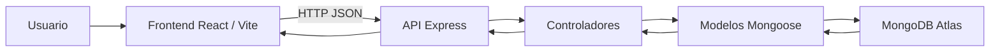
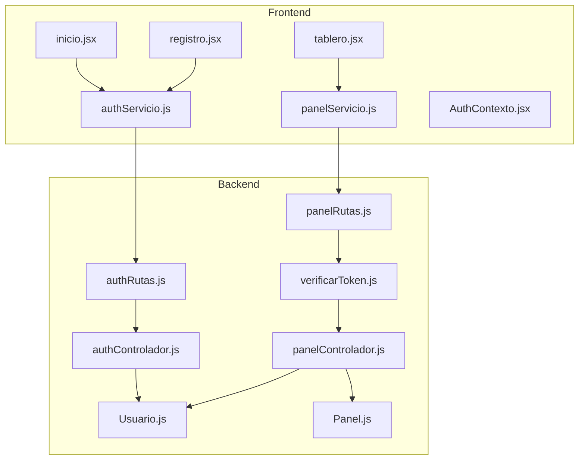

# Arquitectura del sistema

## Tipo de arquitectura utilizada
El proyecto utiliza una arquitectura cliente-servidor con organizacion tipo MVC en el backend:
- Cliente: interfaz React que consume la API REST.
- Servidor: Express con controladores, rutas, middleware y modelos.
- Persistencia: MongoDB Atlas mediante Mongoose.

## Componentes principales
- Frontend:
  Interfaz desarrollada con React, Vite y Tailwind. Gestiona autenticacion, tablero y formularios.
- Backend:
  API REST en Node.js y Express. Maneja autenticacion, seguridad, logica del panel y relacion entrenador-deportista.
- Base de datos:
  MongoDB Atlas. Almacena usuarios, paneles y estructuras embebidas como metas, sesiones, competencias y observaciones.

## Comunicacion entre componentes
1. El frontend envia solicitudes HTTP al backend.
2. El backend valida datos, autentica usuarios y consulta MongoDB.
3. MongoDB devuelve la informacion persistida.
4. El backend normaliza la respuesta y la retorna en JSON.
5. El frontend actualiza la interfaz y los graficos.

## Diagrama representativo

## Estructura tecnica resumida

