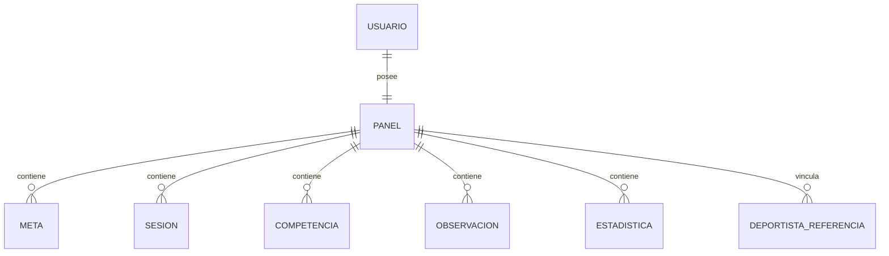

# Diseno de base de datos

## Colecciones principales

### 1. `usuarios`
Guarda la identidad y seguridad de acceso.

Campos principales:
- `nombre`
- `apellidos`
- `correo`
- `contrasena`
- `rol`
- `estado`
- `dobleFactor`
- `fechaRegistro`

### 2. `panels`
Guarda la informacion operativa del tablero de cada usuario.

Campos principales:
- `usuarioId`
- `rol`
- `perfil`
- `estadisticas`
- `metas`
- `logros`
- `competencias`
- `deportistas`
- `sesiones`
- `observaciones`

## Relaciones principales
- Un `usuario` tiene un `panel`.
- Un `entrenador` puede vincular muchos `deportistas`.
- Una `meta` puede asignarse a varios deportistas.
- Una `sesion` puede asignarse a varios deportistas.
- Una `competencia` puede asignarse a varios deportistas.
- Una `observacion` pertenece a un deportista dentro del contexto del entrenador.

## Justificacion del diseno
Se eligio MongoDB porque el sistema maneja estructuras flexibles y anidadas:
- perfiles con campos segun rol,
- metas con asignaciones por deportista,
- sesiones y competencias multiusuario,
- observaciones embebidas por entrenador.

Esto reduce joins complejos y permite entregar rapidamente el tablero completo de cada cuenta.

## Fragmentos representativos de creacion
### Usuario
```js
const usuarioEsquema = new mongoose.Schema({
  nombre: String,
  apellidos: String,
  correo: { type: String, unique: true },
  contrasena: String,
  rol: { type: String, enum: ['deportista', 'entrenador', 'administrador'] },
  dobleFactor: {
    habilitado: Boolean,
    codigoHash: String,
    expiraEn: Date,
    ultimoEnvio: Date,
  },
});
```

### Panel
```js
const panelSchema = new mongoose.Schema({
  usuarioId: { type: mongoose.Schema.Types.ObjectId, ref: 'Usuario', unique: true },
  rol: String,
  perfil: mongoose.Schema.Types.Mixed,
  estadisticas: [estadisticaSchema],
  metas: [metaSchema],
  competencias: [competenciaSchema],
  sesiones: [sesionSchema],
  observaciones: [observacionSchema],
});
```

## Diagrama de relaciones

